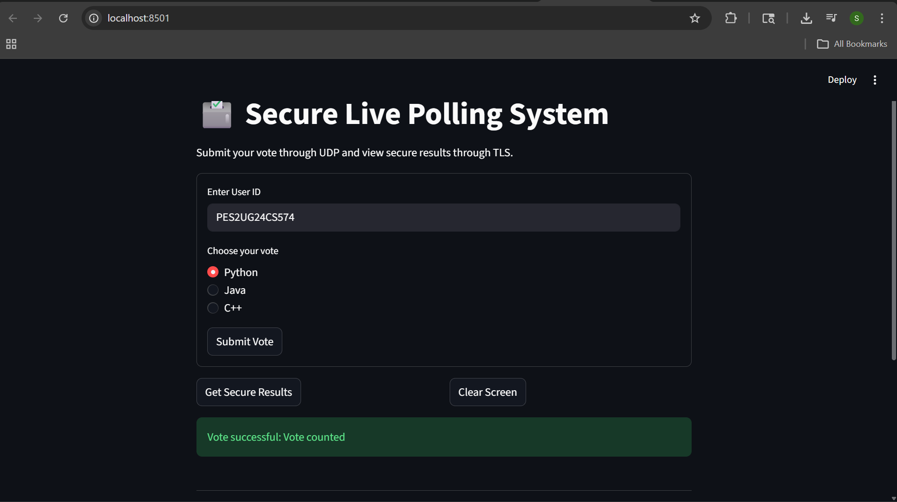
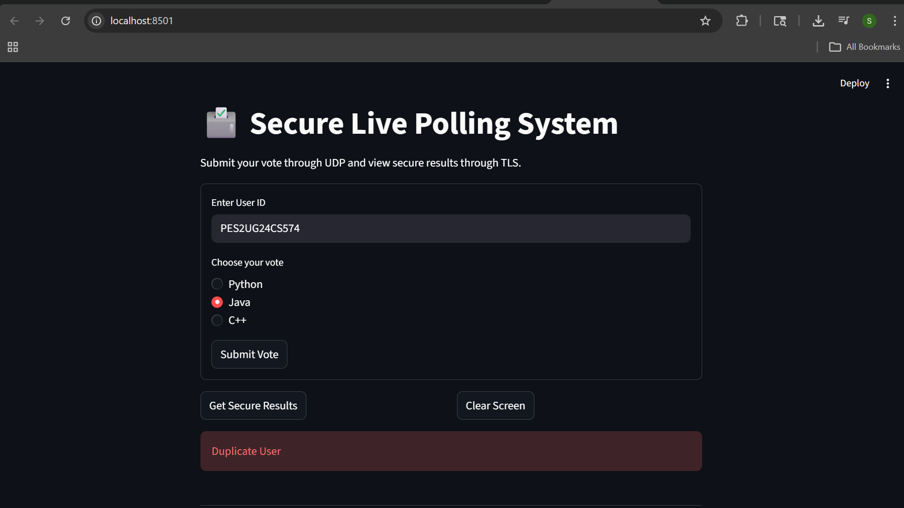
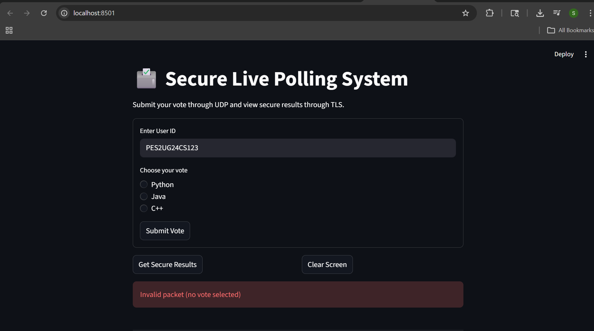
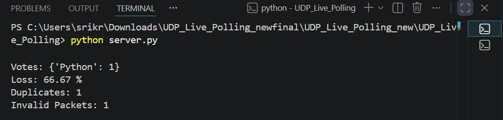

# 🗳️ Secure UDP Live Polling System

A **real-time distributed voting system** built using **UDP for fast vote transmission** and **TLS for secure result retrieval**, with built-in **reliability mechanisms, duplicate detection, and packet loss analysis**.

---

## 📌 Overview
This project demonstrates a **networked polling system** where multiple clients can submit votes concurrently, and a centralized server aggregates results while ensuring:
- ✔️ Reliability over UDP  
- ✔️ Duplicate vote prevention  
- ✔️ Invalid packet detection  
- ✔️ Secure communication via TLS  
- ✔️ Real-time statistics monitoring  

---

## ⚙️ Tech Stack
- Python  
- Socket Programming (UDP & TCP)  
- TLS/SSL Encryption  
- Streamlit (UI)  
- Multithreading  

---

## ✨ Features
- 🚀 Fast vote transmission using UDP  
- 🔒 Secure result fetching via TLS  
- 👤 Duplicate user detection  
- 🌐 Multi-client support (different laptops)  
- ❌ Invalid packet handling  
- 📊 Packet loss calculation (real-world simulation)  
- 📡 Real-time server statistics  
- 🎯 Interactive UI using Streamlit  

---

## 🖥️ System Architecture
Client (Streamlit UI)
↓ UDP
Voting Server (UDP Listener)
↓
Vote Processing + Validation
↓
Stats + Aggregation
↓ TLS
Secure Results Server

---

## 📸 Screenshots

###✅ Successful Vote

### ❌ Duplicate User

### ⚠️ Invalid Packet

### 📊 Server Output & Packet Loss

---

## 📊 Packet Loss Analysis

Unlike TCP, **UDP does not guarantee delivery**, making it important to measure reliability.
This system simulates real-world network behavior by tracking:
- ❌ Invalid packets  
- 🔁 Duplicate votes  
- 📥 Total packets received  
### 📐 Formula Used
Packet Loss (%) = (Invalid Packets + Duplicate Packets) / Total Packets × 100
### 💡 Example
If:
- Total packets = 3  
- Invalid = 1  
- Duplicate = 1  
Then:
Packet Loss = (2 / 3) × 100 = 66.67%

### 🎯 Why This Matters
- Demonstrates **limitations of UDP**
- Shows **fault tolerance design**
- Helps analyze **network reliability**
- Mimics **real distributed system behavior**

---

## 🚀 How to Run
1️⃣ Clone the repository
git clone https://github.com/kruthivankadara-dev/Secure_UDP_Live_Polling_System.git
cd Secure_UDP_Live_Polling_System
2️⃣ Install dependencies
pip install streamlit
3️⃣ Run the server
python server.py
4️⃣ Run the UI
streamlit run streamlit_app.py

---

##🌐 Running on Multiple Systems
--Run server on one laptop
--Update SERVER_HOST in config.py with server IP
--Run client/UI on another laptop

---

##📁 Project Structure
Secure_UDP_Live_Polling_System/
│
├── assets/
│   ├── success.png
│   ├── duplicate.png
│   ├── invalid.png
│   └── server.png
│
├── client.py
├── config.py
├── protocol.py
├── server.py
├── stats.py
├── streamlit_app.py
├── tls_control_client.py
├── tls_control_server.py
├── server.crt
├── server.key
└── README.md

## 👥 Contributors
- 👩‍💻 [Sri Kruthi](https://github.com/kruthivankadara-dev)
- 👨‍💻 [Vishnu](https://github.com/vishnusr594-afk)
- 👩‍💻 [Tharunya](https://github.com/tharunyah)

##🎯 Key Learnings
Handling unreliable protocols like UDP
Designing fault-tolerant distributed systems
Implementing TLS for secure communication
Building real-time systems with concurrency
Analyzing packet loss in distributed environments

##⭐ Future Enhancements
- Add user authentication to prevent identity spoofing and unauthorized voting  
- Replace in-memory vote storage with a persistent database (PostgreSQL / MongoDB)  
- Deploy the system using Docker and cloud platforms (AWS / GCP) for scalability  
- Implement rate limiting and abuse detection for secure large-scale usage  
- Build a real-time analytics dashboard for vote trends and system monitoring  

##📜 License
This project is licensed under the MIT License.
